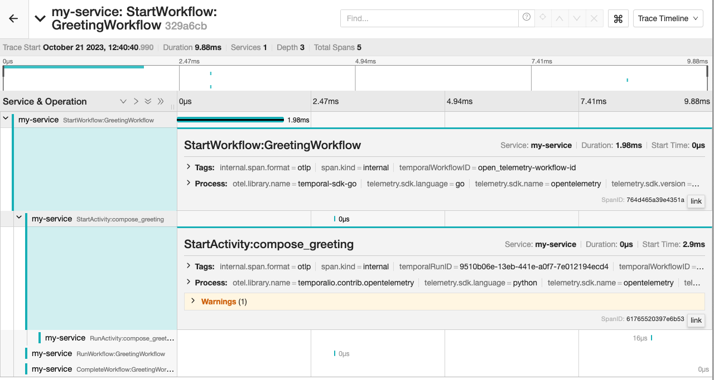

# Temporal Otel Tracing

An example of a Temporal Workflow in Python that is started using a Temporal client in Go. Both the client in the Python Worker, and the client in the Go Starter, are configured with an OpenTelemetry tracing interceptor.

## Setup

Run a local Temporal Server:

```bash
temporal server start-dev 
```

Run a local Jaeger instance:

```bash
docker run --rm --name jaeger \
  -e COLLECTOR_OTLP_ENABLED=true \
  -p 16686:16686 \
  -p 4317:4317 \
  -p 4318:4318 \
  jaegertracing/all-in-one:latest
```

## Run the Python Worker

```bash
cd python-worker
pip install -r requirements.txt
python worker.py
```

## Run the Go Starter

```bash
cd go-starter
go run main.go
```

## View the Trace in Jaeger
Open http://localhost:16686, and see that the trace includes the spans from both the Go Starter and the Python Worker.


